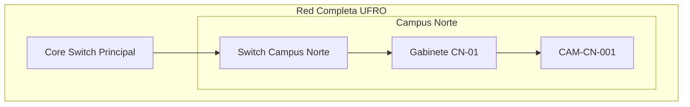

# Nuevas Funcionalidades: Mapas de Red y Análisis por Campus

## Resumen de Mejoras Implementadas

Se han agregado nuevas funcionalidades avanzadas al sistema de gestión de fallas que incluyen mapas de red jerárquicos y análisis detallados por campus.

## 📊 Nuevos Informes Disponibles

### 1. Mapas de Red

#### 🌐 Mapa de Red Completo
- **Descripción**: Topología completa de la red de cámaras y equipos
- **Formato**: Datos Excel + Visualización gráfica
- **Acceso**: `/informes-avanzados` → Mapas de Red → Mapa Completo

#### 🔄 Mapa de Red en Cascada
- **Descripción**: Vista jerárquica de la red hasta gabinete o cámara específica
- **Funcionalidad**: Muestra dependencias en cascada desde el núcleo hasta el dispositivo final
- **Acceso**: `/informes-avanzados` → Mapas de Red → Mapa Cascada

#### 🏛️ Mapa de Red por Campus
- **Descripción**: Topología de red filtrada por campus específico
- **Filtros**: Selección de uno o múltiples campus
- **Acceso**: `/informes-avanzados` → Mapas de Red → Mapa por Campus

#### 📊 Mapa Red Jerárquico
- **Descripción**: Estructura jerárquica completa hasta gabinete, cámara o switch específico
- **Niveles**: Core Switch → Switch → Gabinete → UPS → Cámaras
- **Acceso**: `/informes-avanzados` → Mapas de Red → Mapa Jerárquico

### 2. Inventarios por Campus

#### 📹 Cámaras por Campus
- **Campos**: Campus, Cámara, IP, Ubicación, Estado, Modelo, Gabinete, Switch
- **Orden**: Campus → Ubicación → Nombre
- **Filtros**: Múltiples campus seleccionables

#### 📦 Gabinetes por Campus
- **Información**: Campus, Gabinete, Ubicación, Estado, Cámaras Asociadas
- **Relaciones**: Muestra cuántas cámaras dependen de cada gabinete
- **Utilidad**: Planificación de mantenimiento y análisis de impacto

#### 🔌 Switches por Campus
- **Datos**: Campus, Switch, Ubicación, IP, Estado, Cámaras Conectadas
- **Conectividad**: Mapeo de dependencias de red
- **Gestión**: Identificación de switches críticos

### 3. Informes de Fallas con Filtro por Campus

Todos los informes de fallas existentes ahora incluyen versiones filtradas por campus:

- **Fallas Reparadas por Campus**
- **Fallas Pendientes por Campus** 
- **Fallas en Proceso por Campus**
- **Rendimiento de Técnicos por Campus**
- **Costos de Reparación por Campus**

## 🗂️ Estructura de Base de Datos Actualizada

### Nuevas Tablas

#### `infraestructura_red`
```sql
CREATE TABLE infraestructura_red (
    id INTEGER PRIMARY KEY AUTOINCREMENT,
    componente_id TEXT UNIQUE NOT NULL,
    tipo_componente TEXT NOT NULL,          -- 'Core_Switch', 'Switch', 'Gabinete', 'UPS'
    campus TEXT NOT NULL,
    ubicacion TEXT,
    ip_address TEXT,
    estado TEXT DEFAULT 'Operativo',
    dependencias TEXT,                      -- ID del componente padre
    nivel_jerarquico INTEGER DEFAULT 1,     -- 0=Core, 1=Switch, 2=Gabinete, 3=UPS
    fecha_instalacion TIMESTAMP DEFAULT CURRENT_TIMESTAMP,
    especificaciones TEXT,
    observaciones TEXT
);
```

#### `relaciones_componentes`
```sql
CREATE TABLE relaciones_componentes (
    id INTEGER PRIMARY KEY AUTOINCREMENT,
    componente_padre TEXT NOT NULL,
    componente_hijo TEXT NOT NULL,
    tipo_relacion TEXT NOT NULL,           -- 'alimentacion', 'conexion_red', 'ubicacion_fisica'
    FOREIGN KEY (componente_padre) REFERENCES infraestructura_red (componente_id),
    FOREIGN KEY (componente_hijo) REFERENCES infraestructura_red (componente_id)
);
```

### Campos Agregados a Tablas Existentes

- **`camaras`**: Campo `campus` agregado
- **`fallas`**: Campo `campus` agregado  
- **`fallas_mejoradas`**: Campo `campus` agregado

## 🎯 Nuevas API Endpoints

### Informes de Mapas
- `GET /api/informes/mapa-red-completo` - Datos completos de topología
- `GET /api/informes/mapa-red-cascada` - Vista jerárquica en cascada
- `GET /api/informes/mapa-red-campus` - Topología por campus
- `GET /api/informes/mapa-jerarquico` - Estructura jerárquica completa

### Inventarios por Campus
- `GET /api/informes/camaras-campus` - Inventario de cámaras por campus
- `GET /api/informes/gabinetes-campus` - Inventario de gabinetes por campus
- `GET /api/informes/switches-campus` - Inventario de switches por campus

### Informes Filtrados
- `GET /api/informes/<tipo>/filtro?campus=<campus>&fecha_inicio=<fecha>&fecha_fin=<fecha>`

### Visualizaciones
- `GET /api/mapa-visual/<tipo>?campus=<campus>&objetivo=<objetivo>` - Genera imágenes de mapas

### Utilidades
- `GET /api/campus-disponibles` - Lista de campus configurados en el sistema

## 🖥️ Nueva Interfaz de Usuario

### Página: Informes Avanzados (`/informes-avanzados`)

#### Características:
- **Filtros Avanzados**: Selección múltiple de campus, rangos de fechas
- **Categorías Organizadas**: 
  - Mapas de Red
  - Inventarios por Campus  
  - Informes de Fallas por Campus
- **Dual Output**: Datos (Excel) + Visualización (PNG) para mapas
- **Interfaz Responsiva**: Compatible con dispositivos móviles

#### Filtros Disponibles:
- **Campus**: Selección múltiple con Ctrl
- **Fecha Inicio/Fin**: Rango de fechas para informes de fallas
- **Botón Limpiar**: Resetea todos los filtros

## 📈 Visualizaciones Mermaid

Los mapas de red incluyen visualizaciones generadas automáticamente usando diagramas Mermaid:

### Ejemplo: Mapa Completo


## ⚙️ Configuración e Instalación

### 1. Actualizar Base de Datos
```bash
python actualizar_db_campus.py
```

### 2. Configurar Campus para Cámaras Existentes
```sql
UPDATE camaras SET campus = 'Campus Norte' WHERE ubicacion LIKE '%Norte%';
UPDATE camaras SET campus = 'Campus Sur' WHERE ubicacion LIKE '%Sur%';
UPDATE camaras SET campus = 'Campus Centro' WHERE ubicacion LIKE '%Centro%';
```

### 3. Poblar Infraestructura de Red
El script `actualizar_db_campus.py` incluye datos de ejemplo, pero se recomienda actualizar con datos reales.

## 📋 Casos de Uso

### 1. Análisis de Impacto por Falla de Gabinete
1. Acceder a **Mapa Jerárquico**
2. Identificar componentes dependientes
3. Generar informe de **Fallas por Campus** para análisis histórico

### 2. Planificación de Mantenimiento por Campus
1. Usar **Inventarios por Campus** para identificar equipos
2. Filtrar **Fallas Reparadas por Campus** para patrones
3. Analizar **Costos de Reparación por Campus** para presupuesto

### 3. Monitoreo de Red en Tiempo Real
1. **Mapa de Red Completo** para vista general
2. **Mapa por Campus** para análisis específico
3. **Visualizaciones** para presentaciones ejecutivas

## 🔧 Funcionalidades Técnicas

### Compatibilidad de Base de Datos
- **SQLite**: Para desarrollo local
- **PostgreSQL**: Para producción (Railway, Heroku, etc.)
- **Fallback Automático**: Si falla una consulta avanzada, usa consulta básica

### Generación de Archivos
- **Excel**: Múltiples hojas, formato profesional
- **PNG**: Visualizaciones de alta resolución (1400x1000px)
- **Nombres Únicos**: Timestamp incluido en nombres de archivo

### Rendimiento
- **Consultas Optimizadas**: Uso de índices y joins eficientes
- **Paginación**: Preparado para grandes volúmenes de datos
- **Cache**: Los campus se cargan una vez por sesión

## 🚀 Próximas Mejoras Sugeridas

1. **Filtros Adicionales**:
   - Por tipo de componente
   - Por estado operativo
   - Por rango de IPs

2. **Visualizaciones Interactivas**:
   - Mapas clickeables
   - Zoom en secciones específicas
   - Estados en tiempo real

3. **Alertas Automáticas**:
   - Notificaciones por campus crítico
   - Escalamiento basado en impacto
   - Dashboard en tiempo real

4. **Integración API Externa**:
   - Sistemas de monitoreo de red
   - SNMP para estado de switches
   - Sistemas de tickets automáticos

## 📞 Soporte

Para configuración específica de campus o resolución de problemas:

1. Verificar datos en `infraestructura_red`
2. Confirmar campo `campus` en todas las cámaras
3. Revisar logs de la aplicación para errores SQL
4. Usar endpoint `/api/campus-disponibles` para debug

---

**Versión**: 2.0 - Mapas de Red y Campus  
**Fecha**: 2025-10-18  
**Compatibilidad**: Sistema UFRO v1.x